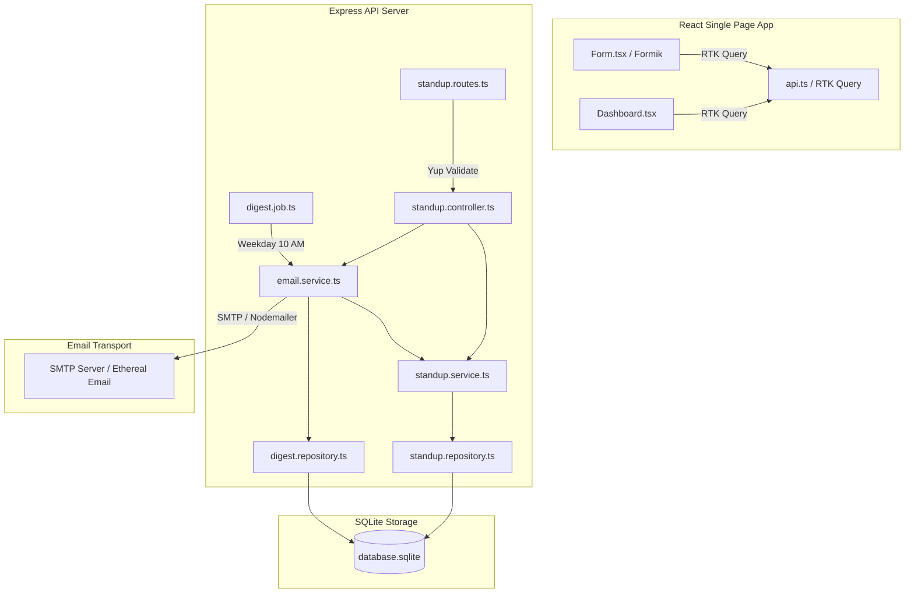

# Developer Handover & Workflow Document

## 1. Project Overview

* **Project Name**: Daily Standup System
* **Business Purpose**: Automates daily status collection, aggregation, and email distribution to engineering management. It replaces manual, time-consuming status pinging with an automated, self-reporting pipeline.
* **Problem Statement**: Remote and hybrid team structures require asynchronous standup monitoring. Managers often struggle to collect timely status updates from developers, track blocker issues, or maintain a centralized history of daily progress without manual friction.
* **Solution Summary**: A single-page dark-mode web portal for team members to submit their daily standup entries (yesterday's tasks, today's focus, and blockers) under configuration-validated credentials, combined with a manager dashboard to monitor daily progress, view pending members, and trigger or schedule HTML email digests with integrated retry policies.
* **Key Features**:
  * **Team Registry Validation**: Restricts standup submissions to a pre-defined team roster (`members.json`) using email checks.
  * **Duplicate submission prevention**: Enforces a database-level unique constraint to limit team members to exactly one standup per day.
  * **Manager Dashboard**: Highlights status cards with custom amber styling for blocker alerts and lists team members who have not yet submitted their daily updates.
  * **Automated & Manual Email Digests**: A cron job automatically aggregates standups and emails the manager every weekday at 10:00 AM. Additionally, managers can trigger digests manually via the dashboard or API.
  * **Robust Email Delivery Retry System**: If the SMTP relay fails, the system logs the failure and schedules background retry tasks (up to 3 attempts at 5-minute intervals) before marking the run as failed.

---

## 2. Technology Stack

| Layer          | Technologies |
| -------------- | ------------ |
| **Frontend**   | React 18, TypeScript, Redux Toolkit, RTK Query, Tailwind CSS, Formik, Yup, Lucide React, Vite |
| **Backend**    | Node.js, Express, TypeScript, better-sqlite3 (SQLite), Helmet, Cors, node-cron, Nodemailer |
| **Database**   | SQLite (Local disk-based relational database) |
| **Infrastructure** | Node.js Runtime, SMTP relay server (with Nodemailer automated fallback to Ethereal Email test accounts for non-configured environments) |
| **Testing**    | Jest, Supertest (backend integration), React Testing Library (frontend UI validation) |

---

## 3. Architecture Overview

### High-Level Architecture
The system employs a modular clean architectural pattern based on the flow:
`Request -> Express Route -> Validation Middleware -> Controller -> Service -> Repository -> SQLite Database`



### Request/Data Flow
1. **Standup Submission**:
   * The user inputs status updates in [Form.tsx](file:///d:/vibe%20code/vibe-coading-2/Project/standup-system/frontend/src/components/Form.tsx).
   * Formik compiles input data and Yup runs client-side checks based on [validation.ts](file:///d:/vibe%20code/vibe-coading-2/Project/standup-system/frontend/src/validations/validation.ts).
   * A `POST /api/v1/standups` request is sent via RTK Query to [app.ts](file:///d:/vibe%20code/vibe-coading-2/Project/standup-system/backend/src/app.ts).
   * The request hits validation in [standup.validation.ts](file:///d:/vibe%20code/vibe-coading-2/Project/standup-system/backend/src/validations/standup.validation.ts).
   * [standup.controller.ts](file:///d:/vibe%20code/vibe-coading-2/Project/standup-system/backend/src/controllers/standup.controller.ts) hands the payload to [standup.service.ts](file:///d:/vibe%20code/vibe-coading-2/Project/standup-system/backend/src/services/standup.service.ts), which verifies user configurations against [members.json](file:///d:/vibe%20code/vibe-coading-2/Project/standup-system/backend/src/config/members.json) and checks the DB to ensure a submission hasn't already been created today.
   * If validated, [standup.repository.ts](file:///d:/vibe%20code/vibe-coading-2/Project/standup-system/backend/src/repositories/standup.repository.ts) runs a SQL INSERT into the SQLite database.

2. **Manager Dashboard Fetching**:
   * The dashboard in [Dashboard.tsx](file:///d:/vibe%20code/vibe-coading-2/Project/standup-system/frontend/src/components/Dashboard.tsx) queries `GET /api/v1/standups?date=YYYY-MM-DD` and `GET /api/v1/standups/members?date=YYYY-MM-DD`.
   * The server queries SQLite, cross-references with the configured member roster, and returns structured lists representing completed standups and pending users.

3. **Digest Email Generation**:
   * At 10:00 AM on weekdays, [digest.job.ts](file:///d:/vibe%20code/vibe-coading-2/Project/standup-system/backend/src/jobs/digest.job.ts) runs, triggering [email.service.ts](file:///d:/vibe%20code/vibe-coading-2/Project/standup-system/backend/src/services/email.service.ts).
   * The digest email service compiles standups into HTML layout tables.
   * The HTML content is dispatched through SMTP.
   * Success or failure states are logged in the SQLite `digest_logs` database table. On failure, background timers attempt retries.

---

## 4. Project Structure

The codebase is split into backend and frontend applications located within [standup-system](file:///d:/vibe%20code/vibe-coading-2/Project/standup-system):

```
Project/standup-system/
├── backend/
│   ├── src/
│   │   ├── config/
│   │   │   ├── db.ts           # SQLite better-sqlite3 connection & schema initialization
│   │   │   └── members.json    # Roster configurations for team members
│   │   ├── controllers/
│   │   │   └── standup.controller.ts # Route controllers mapping req/res with validation
│   │   ├── jobs/
│   │   │   └── digest.job.ts   # Node-cron daily task scheduler for digests
│   │   ├── repositories/
│   │   │   ├── digest.repository.ts # SQLite queries for digest operations
│   │   │   └── standup.repository.ts # SQLite queries for daily standup entries
│   │   ├── routes/
│   │   │   └── standup.routes.ts # Express router routing API paths to controllers
│   │   ├── services/
│   │   │   ├── email.service.ts # HTML email compilers, SMTP dispatch, and retry loops
│   │   │   └── standup.service.ts # Core business logic validation boundaries
│   │   ├── tests/
│   │   │   └── standup.test.ts # Supertest integration tests for backend API
│   │   ├── types/
│   │   │   └── index.ts        # Common TypeScript interfaces for the backend
│   │   ├── validations/
│   │   │   └── standup.validation.ts # Yup validation schemas for API endpoints
│   │   └── app.ts              # Express application configuration and startup
│   ├── .env                    # Application configuration variables
│   ├── .env.example            # Environment configuration template
│   ├── database.sqlite         # SQLite database file containing standups & digest logs
│   ├── jest.config.js          # Testing suite configuration settings
│   ├── package.json            # Node configuration, scripts, and runtime dependencies
│   └── tsconfig.json           # TypeScript compilation settings
└── frontend/
    ├── src/
    │   ├── components/
    │   │   ├── Dashboard.tsx   # Dashboard portal for managers (list of cards, date selectors)
    │   │   ├── Form.tsx        # Glassmorphic developer standup form component
    │   │   └── Form.test.tsx   # Unit tests verifying validation error states
    │   ├── services/
    │   │   └── api.ts          # Redux RTK Query server configuration definitions
    │   ├── store/
    │   │   └── index.ts        # Redux Toolkit global store configuration
    │   ├── types/
    │   │   └── index.ts        # TypeScript schemas and types for frontend
    │   ├── validations/
    │   │   └── validation.ts   # Formik/Yup client-side validation rules
    │   ├── App.tsx             # Main router shell switcher
    │   ├── index.css           # Styling configuration including custom CSS glassmorphism styles
    │   └── main.tsx            # Main React client mount entrypoint
    ├── index.html              # HTML shell template
    ├── tailwind.config.js      # CSS spacing, themes, and font mappings
    ├── vite.config.ts          # Bundler, build pipelines, and dev-server configurations
    └── package.json            # Package dependency trees and run scripts
```

---

## 5. Module Summary

| Module | Purpose | Key Components | Dependencies |
| ------ | ------- | -------------- | ------------ |
| **Database Connection & Schemas** | Establishes the SQLite DB connection and auto-runs tables migration. | [db.ts](file:///d:/vibe%20code/vibe-coading-2/Project/standup-system/backend/src/config/db.ts) | `better-sqlite3` |
| **API Endpoints Routing & Validation** | Directs incoming web calls to handlers after executing structural validation. | [standup.routes.ts](file:///d:/vibe%20code/vibe-coading-2/Project/standup-system/backend/src/routes/standup.routes.ts), [standup.validation.ts](file:///d:/vibe%20code/vibe-coading-2/Project/standup-system/backend/src/validations/standup.validation.ts) | `express`, `yup` |
| **Standup Business Logic** | Manages data insertion boundaries, checking valid emails and avoiding double-entries. | [standup.service.ts](file:///d:/vibe%20code/vibe-coading-2/Project/standup-system/backend/src/services/standup.service.ts), [members.json](file:///d:/vibe%20code/vibe-coading-2/Project/standup-system/backend/src/config/members.json) | Local data files |
| **Email Processing & Background Retries** | Compiles HTML templates, configures SMTP, and fires retry timeouts. | [email.service.ts](file:///d:/vibe%20code/vibe-coading-2/Project/standup-system/backend/src/services/email.service.ts), [digest.job.ts](file:///d:/vibe%20code/vibe-coading-2/Project/standup-system/backend/src/jobs/digest.job.ts) | `nodemailer`, `node-cron` |
| **Data Query Layer** | Encapsulates DB queries from service operations. | [standup.repository.ts](file:///d:/vibe%20code/vibe-coading-2/Project/standup-system/backend/src/repositories/standup.repository.ts), [digest.repository.ts](file:///d:/vibe%20code/vibe-coading-2/Project/standup-system/backend/src/repositories/digest.repository.ts) | `better-sqlite3` |
| **Frontend State Store** | Houses global store setups and RTK query APIs. | [index.ts](file:///d:/vibe%20code/vibe-coading-2/Project/standup-system/frontend/src/store/index.ts), [api.ts](file:///d:/vibe%20code/vibe-coading-2/Project/standup-system/frontend/src/services/api.ts) | `@reduxjs/toolkit` |
| **Developer Submission UI** | Form displaying inputs, loading/error animations, and checkmarks. | [Form.tsx](file:///d:/vibe%20code/vibe-coading-2/Project/standup-system/frontend/src/components/Form.tsx), [validation.ts](file:///d:/vibe%20code/vibe-coading-2/Project/standup-system/frontend/src/validations/validation.ts) | `react`, `formik`, `yup` |
| **Manager Metric Board** | Renders cards, date filters, pending rosters, and email dispatch inputs. | [Dashboard.tsx](file:///d:/vibe%20code/vibe-coading-2/Project/standup-system/frontend/src/components/Dashboard.tsx) | `react`, `lucide-react` |

---

## 6. Database Overview

The project uses a lightweight relational SQLite database configured under [database.sqlite](file:///d:/vibe%20code/vibe-coading-2/Project/standup-system/backend/database.sqlite).

### Entity-Relationship Details

| Entity / Collection | Purpose | Relationships |
| ------------------- | ------- | ------------- |
| `standups` | Stores individual user standups containing text logs, date strings, and tracking IDs. | Identifies users by their configured email. |
| `digest_logs` | Logs attempts to email managers, storing status tags and attempt counts. | Logs retry attempts grouped by date. |

### Schema Structure

#### Table: `standups`
* `id` (TEXT PRIMARY KEY) - Unique ID generated upon insertion.
* `member_name` (TEXT NOT NULL) - Submitting developer's name.
* `member_email` (TEXT NOT NULL) - Submitting developer's email address.
* `yesterday` (TEXT NOT NULL) - Yesterday's logs text.
* `today` (TEXT NOT NULL) - Today's focal tasks text.
* `blockers` (TEXT NOT NULL) - Blocker description (default is "none").
* `submitted_at` (TEXT NOT NULL) - ISO 8601 creation timestamp.
* `date` (TEXT NOT NULL) - Target date of the submission (`YYYY-MM-DD`).
* *Constraint*: `UNIQUE(member_email, date)` preventing duplicate logs.

#### Table: `digest_logs`
* `id` (TEXT PRIMARY KEY) - Log identifier.
* `date` (TEXT NOT NULL) - Target standup date of the digest (`YYYY-MM-DD`).
* `attempt_number` (INTEGER NOT NULL) - Current retry index (ranges from 1 to 3).
* `outcome` (TEXT NOT NULL) - Execution result (`SUCCESS` or `FAILED`).
* `error_reason` (TEXT NULLABLE) - Error message from SMTP when failures occur.
* `sent_at` (TEXT NOT NULL) - ISO 8601 timestamp logging execution.

---

## 7. API Overview

Endpoints return structured JSON matching: `{ status: number, message: string, data: any }`.

| Endpoint | Method | Purpose | Auth Required |
| -------- | ------ | ------- | ------------- |
| `/api/v1/standups` | `POST` | Inserts a new developer standup log for today. | No (Emailed identity validated against [members.json](file:///d:/vibe%20code/vibe-coading-2/Project/standup-system/backend/src/config/members.json)) |
| `/api/v1/standups` | `GET` | Fetches standups and pending roster list for a specific `date` query parameter (`?date=YYYY-MM-DD`). | No |
| `/api/v1/standups/members` | `GET` | Returns list of team members indicating whether they submitted for `date`. | No |
| `/api/v1/digest/send` | `POST` | Triggers immediate compile and email of standups for a specified `date` to a specified `recipient_email`. | No |
| `/api/v1/digest/status` | `GET` | Verifies dispatch status, attempt logs, and statistics for a given `date` query parameter (`?date=YYYY-MM-DD`). | No |

### Authentication and Authorization Flow
To streamline internal enterprise deployments, standard tokens (e.g., JWT) are bypassed. Identity verification is done by checking the user's selected email against the pre-configured [members.json](file:///d:/vibe%20code/vibe-coading-2/Project/standup-system/backend/src/config/members.json) array. The client application passes the selected dropdown email within payloads, and the backend validates it before allowing writes.

---

## 8. Environment & Setup

### Required Environment Variables
Configure these variables in a `.env` file within the [backend](file:///d:/vibe%20code/vibe-coading-2/Project/standup-system/backend) directory:

```ini
PORT=5000
SMTP_HOST=smtp.mailtrap.io
SMTP_PORT=2525
SMTP_USER=your_smtp_username
SMTP_PASS=your_smtp_password
SMTP_FROM="Daily Standup" <standup@company.com>
MANAGER_EMAIL=manager@company.com
```
> [!NOTE]
> If `SMTP_HOST`, `SMTP_USER`, or `SMTP_PASS` are omitted or left blank, the application automatically creates an Ethereal Email test account and prints the mock inbox access URL to the terminal logs.

### Installation Steps
Ensure Node.js (v18+) is installed on your local system, then follow the instructions below.

#### Step A: Configure and start the Backend API
1. Navigate to the backend directory:
   ```bash
   cd "d:\vibe code\vibe-coading-2\Project\standup-system\backend"
   ```
2. Install dependencies:
   ```bash
   npm install
   ```
3. Set up the environment variables:
   * Copy the example file: `cp .env.example .env` (or run `copy .env.example .env` in PowerShell).
   * Fill in your SMTP settings.
4. Execute the integration tests:
   ```bash
   npm test
   ```
5. Run the dev server:
   ```bash
   npm run dev
   ```
   *(Running locally on `http://localhost:5000`)*

#### Step B: Configure and start the Frontend Client
1. Open a new terminal instance and navigate to the frontend directory:
   ```bash
   cd "d:\vibe code\vibe-coading-2\Project\standup-system\frontend"
   ```
2. Install client dependencies:
   ```bash
   npm install
   ```
3. Run the development server:
   ```bash
   npm run dev
   ```
   *(Running locally on `http://localhost:3000` via Vite, configured to proxy API requests to the backend)*

---

## 9. Business Workflows

### Workflow 1: Developer Daily Submission
* **Purpose**: Allows a developer to submit their daily standup progress.
* **Steps**:
  1. The user visits the frontend application.
  2. They select their name from the configured dropdown menu.
  3. They fill in what they completed **Yesterday**, their plan for **Today**, and any **Blockers** (defaults to "none").
  4. The user clicks the **Submit Daily Standup** button.
* **Validation Rules**:
  * Fields cannot be blank.
  * The selected developer email must exist in the configuration registry.
  * Users can only submit one standup per calendar day.
* **Expected Outcome**: A `201 Created` JSON payload returns. The client UI changes to a green checkmark success screen, and the record is stored in SQLite.

### Workflow 2: Daily Standup Digest Dispatch
* **Purpose**: Compiles all submissions for the day and sends an email report to the manager.
* **Steps**:
  * **Automated Flow**: A weekday cron job triggers at 10:00 AM.
  * **Manual Flow**: The manager clicks **Send Email Digest** in the dashboard UI.
  * The server retrieves all submitted standup records and identifies any team members who have not submitted yet.
  * The system builds an HTML document, highlighting blockers in amber, and sends the email.
* **Validation Rules**:
  * If the email dispatch fails, the system logs the failure and schedules a background retry. It will retry up to 3 times, spaced 5 minutes apart.
* **Expected Outcome**: An email is successfully delivered to the configured manager's address. The dashboard status updates to display the dispatch time.

---

## 10. Security & Error Handling

### Security Implementations
* **Helmet Middleware**: Configures HTTP headers to protect against web vulnerabilities.
* **CORS Settings**: Restricts cross-origin resource sharing.
* **SQL Injection Prevention**: Uses pre-compiled SQL queries with parameterized inputs via `better-sqlite3`.

### Error Handling Strategy
Express routes are wrapped in a centralized middleware handler in [app.ts](file:///d:/vibe%20code/vibe-coading-2/Project/standup-system/backend/src/app.ts). Custom exceptions specify HTTP status codes and logical error strings to return uniform, structured error payloads.

| Scenario | Expected Behavior |
| -------- | ----------------- |
| **Invalid Email Submission** | The server checks the member configurations and returns `404 MEMBER_NOT_FOUND` to the client. |
| **Double Submission** | Database unique constraints block the operation and return `409 DUPLICATE_SUBMISSION` with a conflict message. |
| **Incorrect Date Formats** | The controller validates query parameters and returns `400 INVALID_DATE_FORMAT` if formats do not match `YYYY-MM-DD`. |
| **SMTP Delivery Failure** | The application logs the error in the `digest_logs` table, schedules a background retry task, and returns `500 EMAIL_SEND_FAILED`. |
| **Empty Form Fields** | Yup schemas identify empty fields, preventing form submissions and highlighting errors inline. |

---

## 11. Testing Overview

### Testing Configurations

| Test Type | Coverage | Tools |
| --------- | -------- | ----- |
| **API Integration Tests** | Verifies database writes, validation, duplicate prevention, and response structures. | Jest, Supertest, ts-jest |
| **Frontend Form Unit Tests** | Verifies client-side validation logic and error feedback in the form UI. | Jest, React Testing Library |

### Test Commands
* **Run Backend Integration Tests**:
  Navigate to the `/backend` folder and run:
  ```bash
  npm test
  ```
  *(Tests execute against an in-memory SQLite database instance configured in `db.ts` to prevent test logs from writing to the persistent database file).*

---

## 12. Deployment & Operations

### Deployment Process
1. **Compile Backend Services**:
   ```bash
   cd backend
   npm run build
   ```
2. **Build Frontend Web Assets**:
   ```bash
   cd frontend
   npm run build
   ```
3. **Deploy Build Output**:
   Move the compiled backend `/dist` folder to your target server environment and set your environment variables. Deploy the static HTML/JS assets inside the frontend `/dist` directory to your web server (e.g., Nginx, S3).

### CI/CD Deployment Pipeline
1. **Lint Checks**: Ensures the code meets linting standards.
2. **Automated Testing**: Runs `npm test` to verify there are no test regressions.
3. **Docker compilation**: Packages the application into containers (if configured).

### Monitoring & Operations
* Monitor server consoles for error logs.
* Check the SQLite `digest_logs` table periodically to monitor email delivery outcomes.
* **Database Backup Strategy**: Back up database files by copying the [database.sqlite](file:///d:/vibe%20code/vibe-coading-2/Project/standup-system/backend/database.sqlite) file to a backup location.

---

## 13. Known Limitations & Future Enhancements

| Type | Description | Priority |
| ---- | ----------- | -------- |
| **Security Improvement** | Add user authentication (e.g., SSO or OAuth2) instead of relying on a static email dropdown. | High |
| **Database Scaling** | Migrate from local SQLite files to PostgreSQL for production environments with multiple concurrent users. | Medium |
| **Usability Enhancement** | Allow users to edit or update their submitted standup entries later in the day. | Low |

---

## 14. Troubleshooting Guide

| Issue | Resolution |
| ----- | ---------- |
| **SMTP Email Dispatch Fails** | Verify that your SMTP credentials in the `.env` file are correct. If no credentials are set, check the backend console output for the mock Ethereal inbox URL where you can view test emails. |
| **SQLITE_CONSTRAINT Unique Errors** | This error indicates that a user has already submitted a standup log for today. You will need to wait until the next day or clear the `standups` table to submit again. |
| **CORS / API Routing Connection Refused** | Ensure that the proxy settings in the frontend `vite.config.ts` file point to the correct port that the backend is running on (default is `http://localhost:5000`). |

---

## 15. Developer Quick Start

To set up your local development environment, follow these steps:

1. **Install dependencies**:
   Run `npm install` in both the backend and frontend folders.
2. **Configure your environment**:
   Create a `.env` file in the backend directory using the template in `.env.example`.
3. **Start the application**:
   * Run the backend server: `npm run dev` (running on `http://localhost:5000`)
   * Run the frontend server: `npm run dev` (running on `http://localhost:3000`)
4. **Run tests**:
   Verify your setup by running the integration tests inside the backend directory:
   ```bash
   npm test
   ```
5. **Build for production**:
   Compile backend and frontend services using `npm run build` inside their respective directories.
6. **Deploy**:
   Serve your compiled backend application and static frontend client files.
